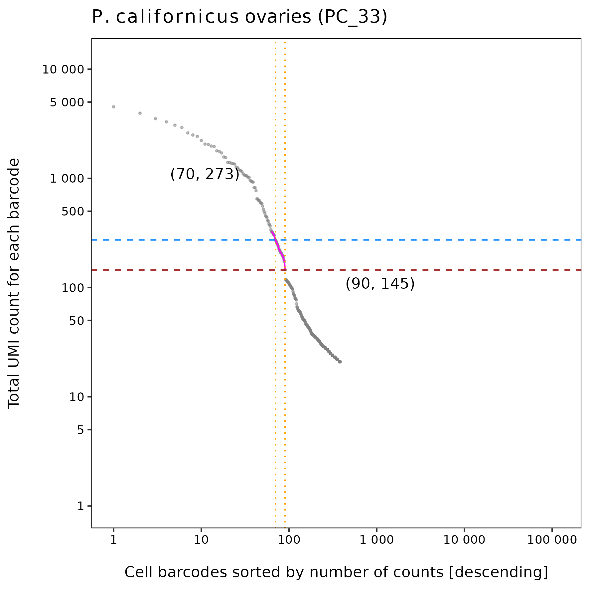
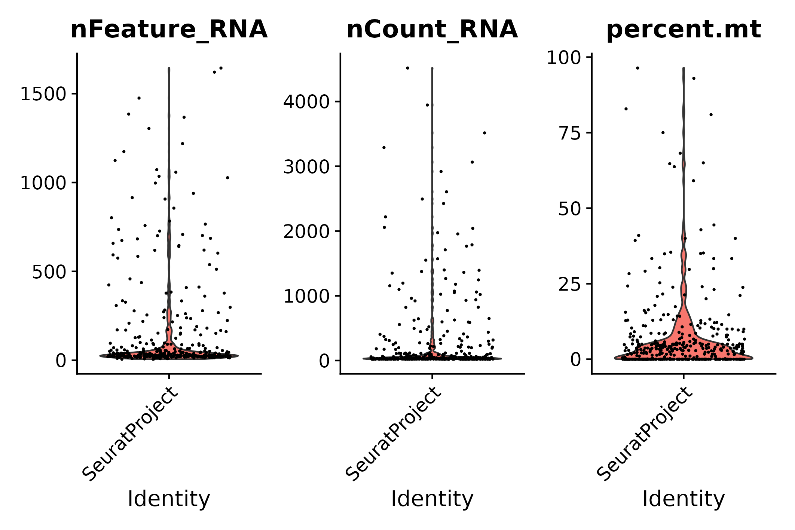
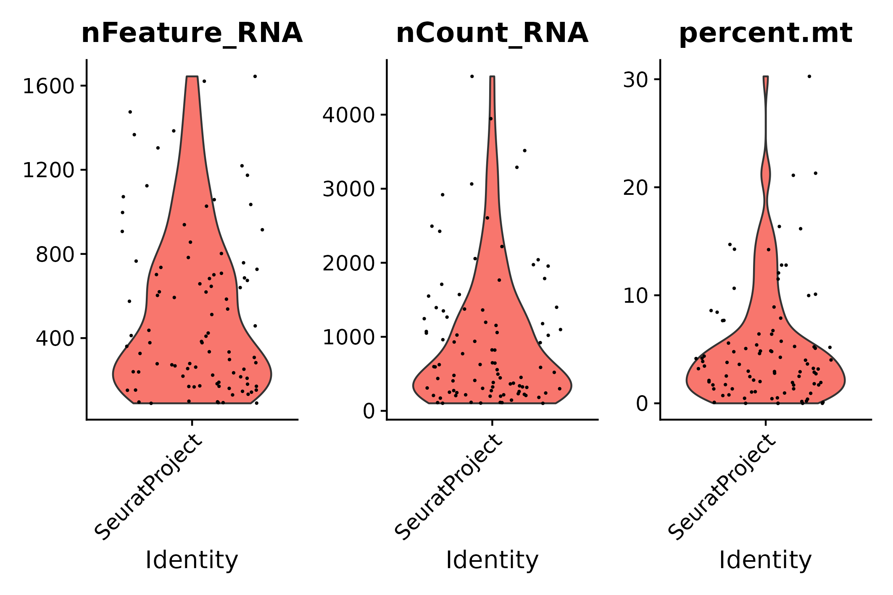
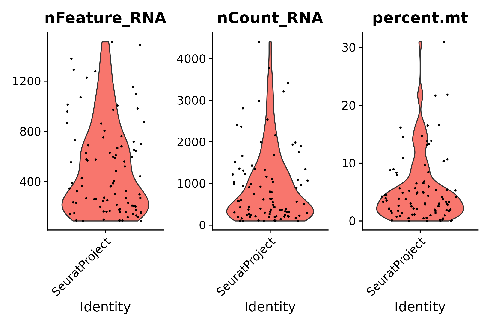
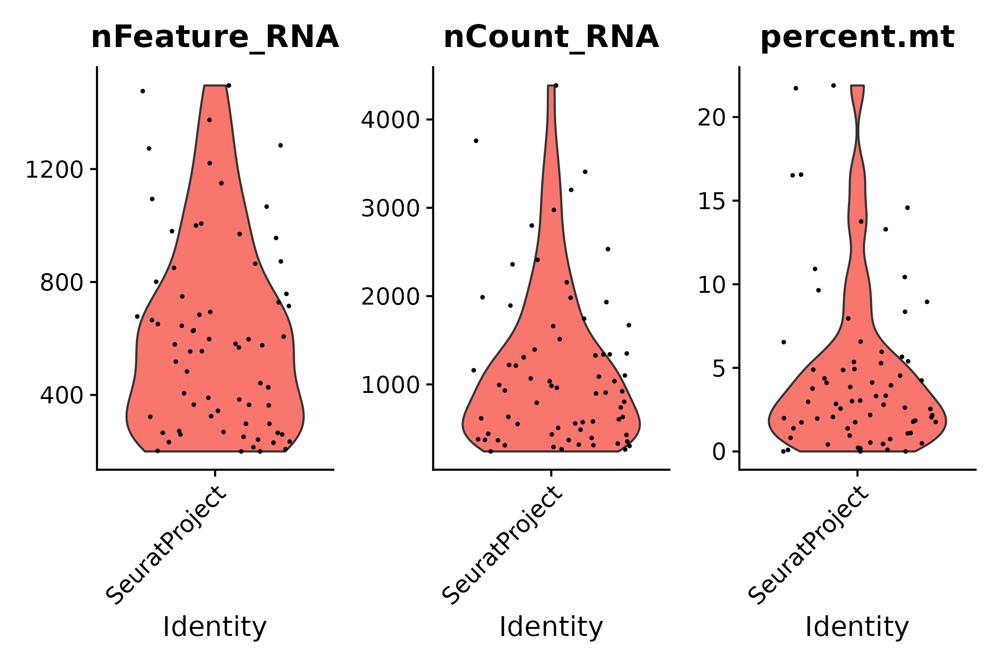
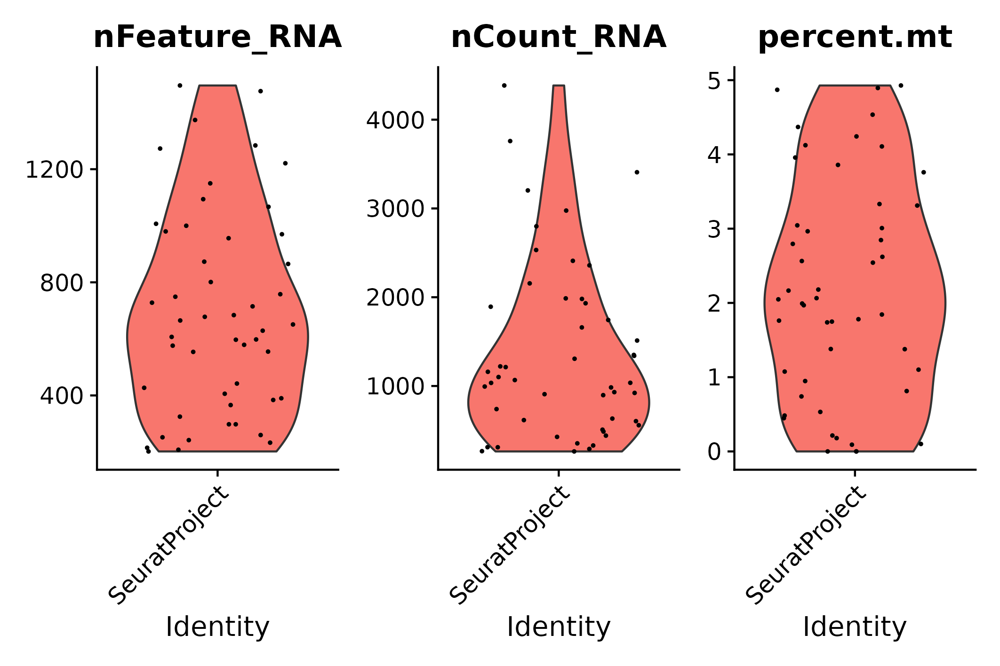
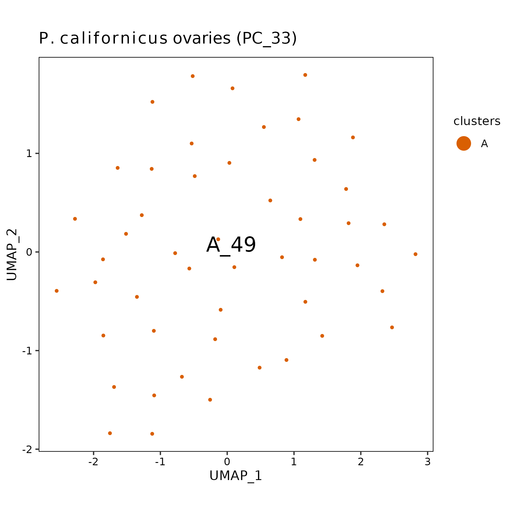

pc33 analysis using Drop-seq core computational protocol
================
Andrea Elizabeth Acurio Armas, Bulah Wu, Petr Nguyen  
October 23, 2024

### FastQC

Output can be found [here (read
1)](../shared/fastqc/pc33_read1/fastqc.md) and [here (read
2)](../shared/fastqc/pc33_read2/fastqc.md).

 

### barcodeRanks()

The raw matrix is extracted by selecting cells that have ≥ 20 UMI
(suggested by [James
Nemesh](https://brain.broadinstitute.org/team/james_nemesh/)).

barcodeRanks() output

 

### emptyDrops()

|       | FALSE | TRUE |
|:------|------:|-----:|
| FALSE |    12 |   13 |
| TRUE  |     0 |   80 |

93 cells are identified.

 

### vlnplot()

- The raw matrix
  

  
  

  pre-emptydrops
  

  

|     | Gene | Cell | Mean UMI/Cell | Median UMI/Cell | Mean Gene/Cell | Median Gene/Cell |
|:----|-----:|-----:|--------------:|----------------:|---------------:|-----------------:|
| Raw | 5756 |  396 |           255 |              34 |       146.7854 |               29 |

 

- After emptyDrops()
  

  
  

  post-emptydrops
  

  

|  | Gene | Cell | Mean UMI/Cell | Median UMI/Cell | Mean Gene/Cell | Median Gene/Cell |
|:---|---:|---:|---:|---:|---:|---:|
| emptyDrops | 5756 | 93 | 961.1183 | 597 | 523.0968 | 384 |

 

- STEP 1: filter genes detected in \< 3 cells
  

  
  

  seurat filter step 1
  

  

|       | Gene | Cell | Mean UMI/Cell | Median UMI/Cell | Mean Gene/Cell | Median Gene/Cell |
|:------|-----:|-----:|--------------:|----------------:|---------------:|-----------------:|
| Step1 | 3688 |   93 |      929.5699 |             581 |       494.2903 |              368 |

 

- STEP 2: filter cells that contain \< 200 genes detected
  

  
  

  seurat filter step 2
  

  

|       | Gene | Cell | Mean UMI/Cell | Median UMI/Cell | Mean Gene/Cell | Median Gene/Cell |
|:------|-----:|-----:|--------------:|----------------:|---------------:|-----------------:|
| Step2 | 3602 |   70 |      1174.086 |             946 |       610.2571 |            577.5 |

 

- STEP 3.1: following STEP 2, filter cells that contain ≤ 200 genes or ≥
  2500 genes detected
  

  
  

  seurat filter step 3.1
  

  

|  | Gene | Cell | Mean UMI/Cell | Median UMI/Cell | Mean Gene/Cell | Median Gene/Cell |
|:---|---:|---:|---:|---:|---:|---:|
| Step3.1 | 3602 | 68 | 1199.515 | 972.5 | 622.3235 | 580 |

 

- STEP 3.2: following STEP 2, filter cells that contain ≥ 5%
  mitochondrial counts
  

  
  

  seurat filter step 3.2
  

  

|  | Gene | Cell | Mean UMI/Cell | Median UMI/Cell | Mean Gene/Cell | Median Gene/Cell |
|:---|---:|---:|---:|---:|---:|---:|
| Step3.2 | 3602 | 50 | 1350.84 | 1051.5 | 687.16 | 640 |

 

- STEP 3: following STEP 2, filter cells that contain ≤ 200 genes or ≥
  2500 genes detected, and filter cells that contain ≥ 5% mitochondrial
  counts
  

  
  

  seurat filter step 3
  

  

|       | Gene | Cell | Mean UMI/Cell | Median UMI/Cell | Mean Gene/Cell | Median Gene/Cell |
|:------|-----:|-----:|--------------:|----------------:|---------------:|-----------------:|
| Step3 | 3602 |   49 |       1373.49 |            1067 |        697.102 |              651 |

 

- Summary

|  | Gene | Cell | Mean UMI/Cell | Median UMI/Cell | Mean Gene/Cell | Median Gene/Cell |
|:---|---:|---:|---:|---:|---:|---:|
| Raw | 5756 | 396 | 255.0000 | 34.0 | 146.7854 | 29.0 |
| emptyDrops | 5756 | 93 | 961.1183 | 597.0 | 523.0968 | 384.0 |
| Step1 | 3688 | 93 | 929.5699 | 581.0 | 494.2903 | 368.0 |
| Step2 | 3602 | 70 | 1174.0857 | 946.0 | 610.2571 | 577.5 |
| Step3.1 | 3602 | 68 | 1199.5147 | 972.5 | 622.3235 | 580.0 |
| Step3.2 | 3602 | 50 | 1350.8400 | 1051.5 | 687.1600 | 640.0 |
| Step3 | 3602 | 49 | 1373.4898 | 1067.0 | 697.1020 | 651.0 |

 

### UMAP

umap

 
