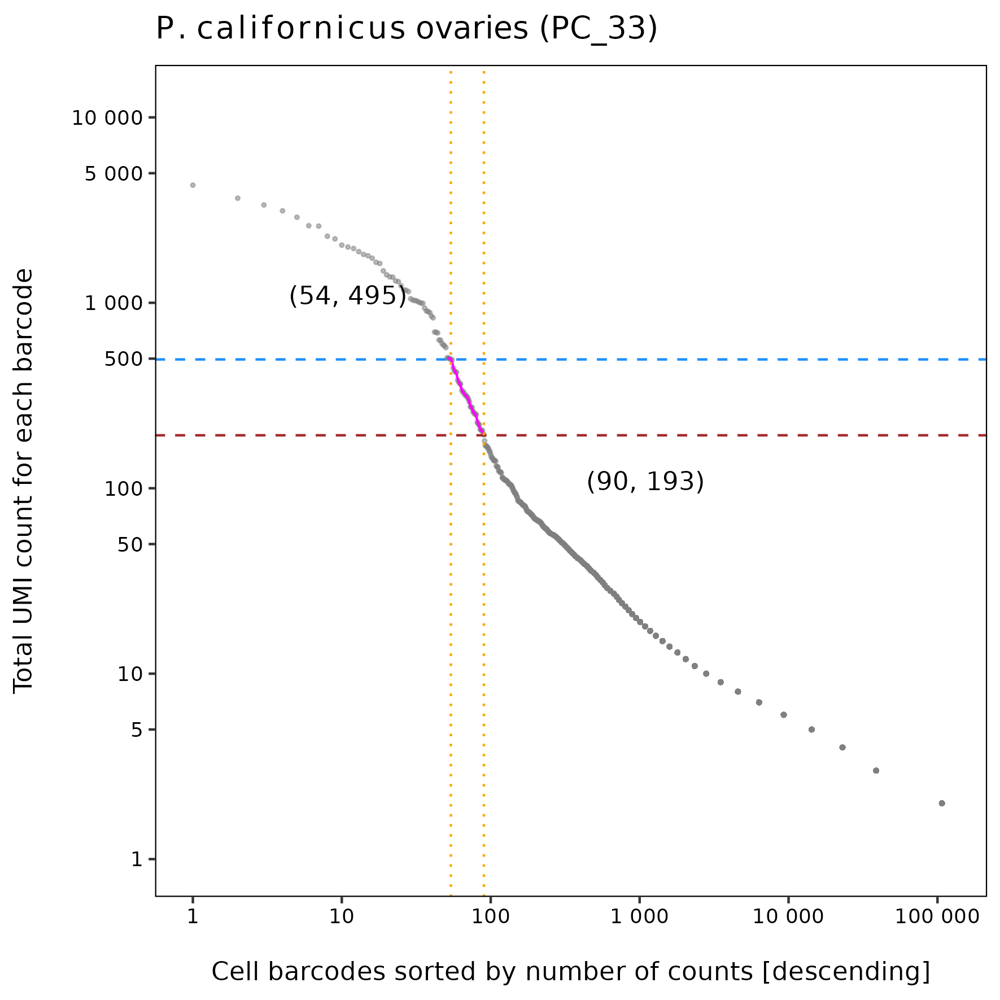
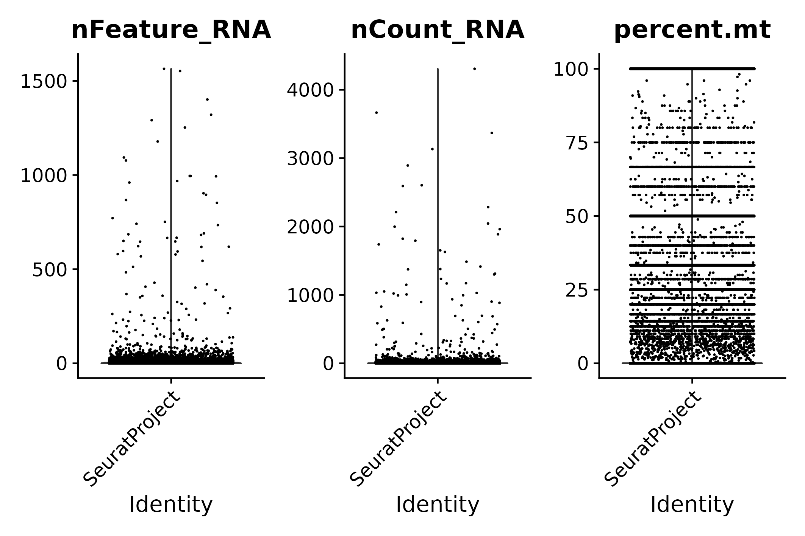
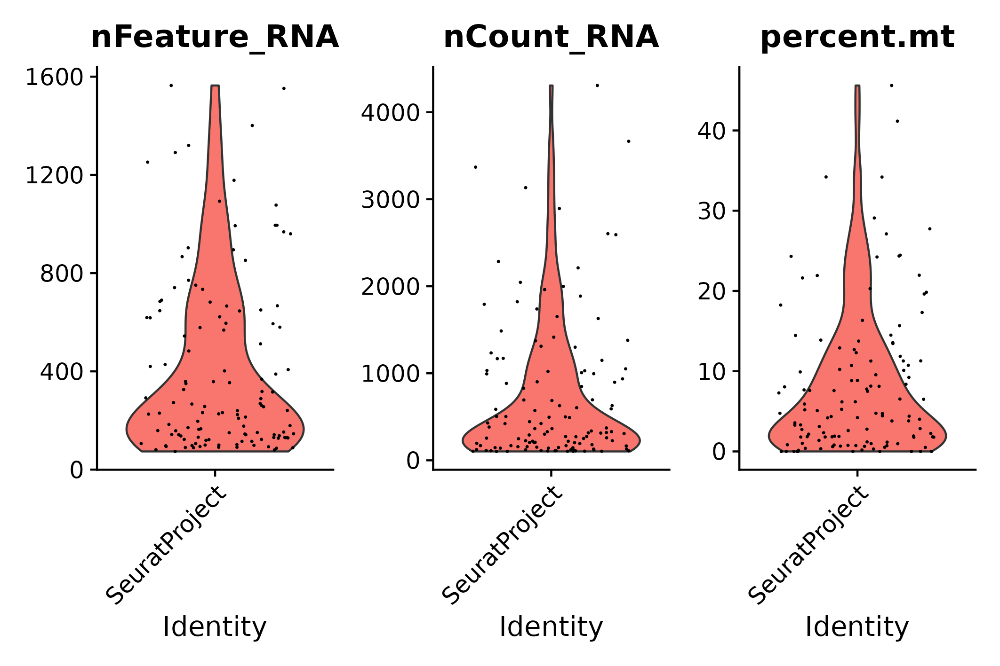
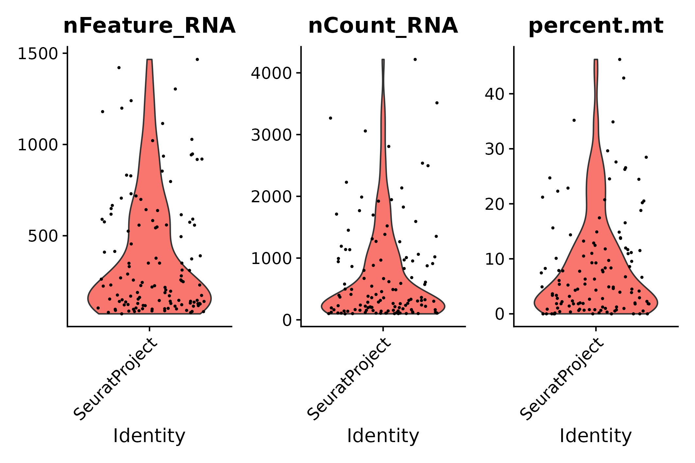
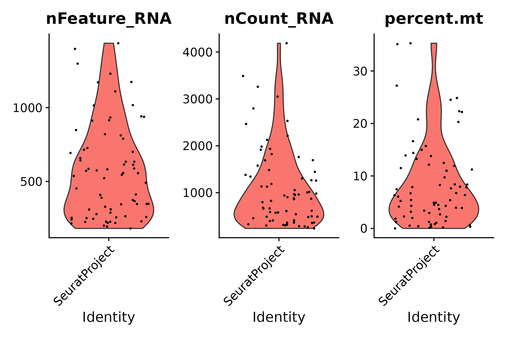
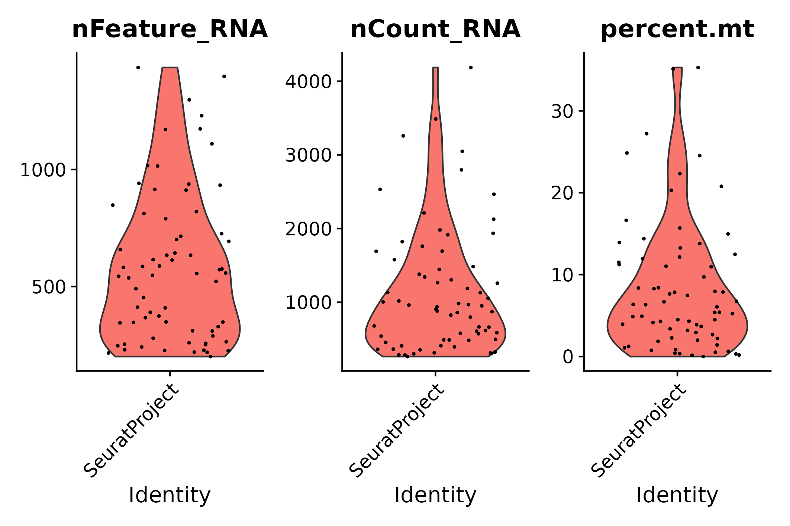
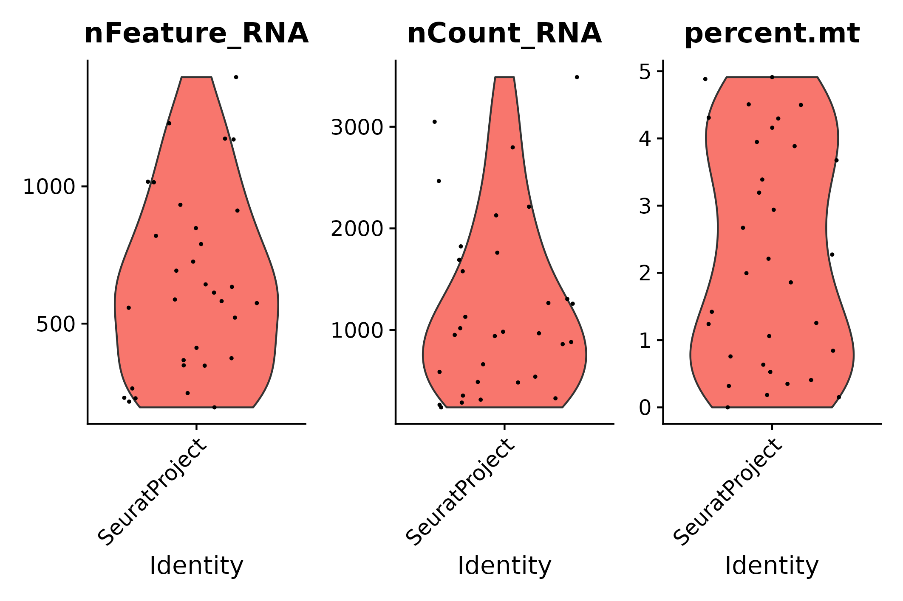
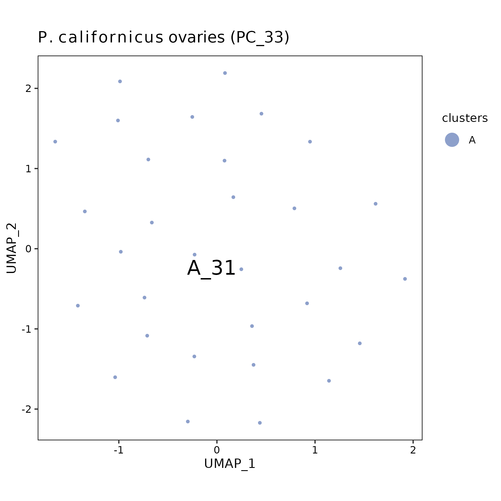

pc33 analysis using STARsolo raw matrix
================
Andrea Elizabeth Acurio Armas, Bulah Wu, Petr Nguyen  
October 23, 2024

### FastQC

Output can be found [here (read
1)](../shared/fastqc/pc33_read1/fastqc.md) and [here (read
2)](../shared/fastqc/pc33_read2/fastqc.md).

 

### barcodeRanks()

barcodeRanks() output

 

### emptyDrops()

|       | FALSE | TRUE |
|:------|------:|-----:|
| FALSE |    13 |    5 |
| TRUE  |     0 |  120 |

125 cells are identified.

 

### vlnplot()

- The raw matrix
  

  
  

  pre-emptydrops
  

  

|     |  Gene |   Cell | Mean UMI/Cell | Median UMI/Cell | Mean Gene/Cell | Median Gene/Cell |
|:----|------:|-------:|--------------:|----------------:|---------------:|-----------------:|
| Raw | 11320 | 165093 |       2.49391 |               1 |       2.144658 |                1 |

 

- After emptyDrops()
  

  
  

  post-emptydrops
  

  

|  | Gene | Cell | Mean UMI/Cell | Median UMI/Cell | Mean Gene/Cell | Median Gene/Cell |
|:---|---:|---:|---:|---:|---:|---:|
| emptyDrops | 11320 | 125 | 734.096 | 364 | 405.344 | 241 |

 

- STEP 1: filter genes detected in \< 3 cells
  

  
  

  seurat filter step 1
  

  

|       | Gene | Cell | Mean UMI/Cell | Median UMI/Cell | Mean Gene/Cell | Median Gene/Cell |
|:------|-----:|-----:|--------------:|----------------:|---------------:|-----------------:|
| Step1 | 3701 |  125 |       711.216 |             356 |        384.232 |              230 |

 

- STEP 2: filter cells that contain \< 200 genes detected
  

  
  

  seurat filter step 2
  

  

|       | Gene | Cell | Mean UMI/Cell | Median UMI/Cell | Mean Gene/Cell | Median Gene/Cell |
|:------|-----:|-----:|--------------:|----------------:|---------------:|-----------------:|
| Step2 | 3521 |   72 |      1111.361 |           893.5 |       573.3472 |              546 |

 

- STEP 3.1: following STEP 2, filter cells that contain ≤ 200 genes or ≥
  2500 genes detected
  

  
  

  seurat filter step 3.1
  

  

|  | Gene | Cell | Mean UMI/Cell | Median UMI/Cell | Mean Gene/Cell | Median Gene/Cell |
|:---|---:|---:|---:|---:|---:|---:|
| Step3.1 | 3521 | 70 | 1134.486 | 923 | 584.3429 | 552 |

 

- STEP 3.2: following STEP 2, filter cells that contain ≥ 5%
  mitochondrial counts
  

  
  

  seurat filter step 3.2
  

  

|  | Gene | Cell | Mean UMI/Cell | Median UMI/Cell | Mean Gene/Cell | Median Gene/Cell |
|:---|---:|---:|---:|---:|---:|---:|
| Step3.2 | 3521 | 32 | 1222.219 | 975.5 | 645.9375 | 600.5 |

 

- STEP 3: following STEP 2, filter cells that contain ≤ 200 genes or ≥
  2500 genes detected, and filter cells that contain ≥ 5% mitochondrial
  counts
  

  
  

  seurat filter step 3
  

  

|       | Gene | Cell | Mean UMI/Cell | Median UMI/Cell | Mean Gene/Cell | Median Gene/Cell |
|:------|-----:|-----:|--------------:|----------------:|---------------:|-----------------:|
| Step3 | 3521 |   31 |      1253.935 |             983 |       660.4839 |              613 |

 

- Summary

|  | Gene | Cell | Mean UMI/Cell | Median UMI/Cell | Mean Gene/Cell | Median Gene/Cell |
|:---|---:|---:|---:|---:|---:|---:|
| Raw | 11320 | 165093 | 2.49391 | 1.0 | 2.144658 | 1.0 |
| emptyDrops | 11320 | 125 | 734.09600 | 364.0 | 405.344000 | 241.0 |
| Step1 | 3701 | 125 | 711.21600 | 356.0 | 384.232000 | 230.0 |
| Step2 | 3521 | 72 | 1111.36111 | 893.5 | 573.347222 | 546.0 |
| Step3.1 | 3521 | 70 | 1134.48571 | 923.0 | 584.342857 | 552.0 |
| Step3.2 | 3521 | 32 | 1222.21875 | 975.5 | 645.937500 | 600.5 |
| Step3 | 3521 | 31 | 1253.93548 | 983.0 | 660.483871 | 613.0 |

 

### UMAP

umap

 
