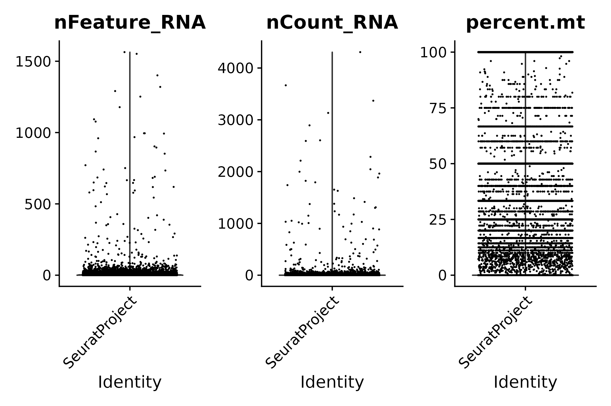
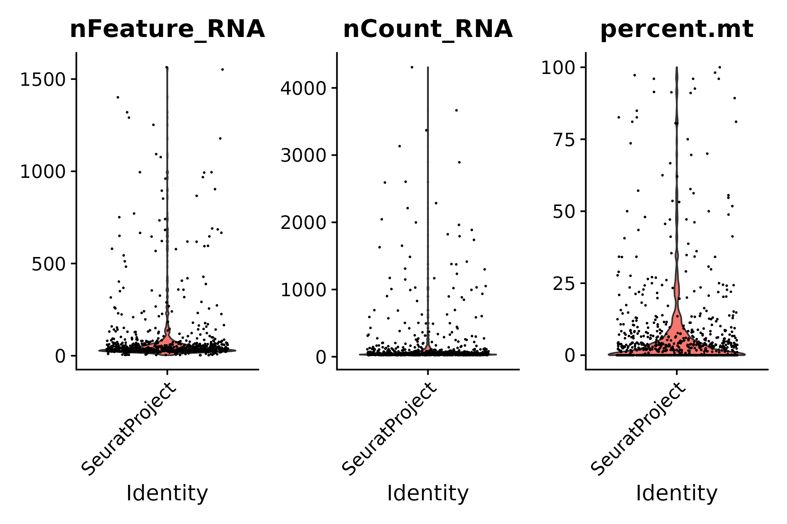
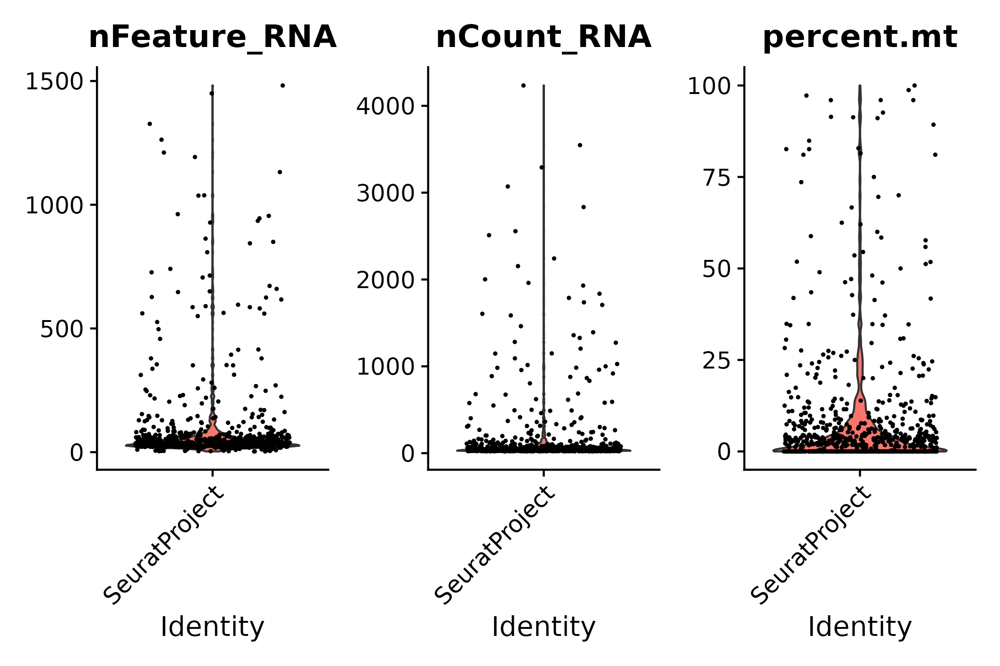
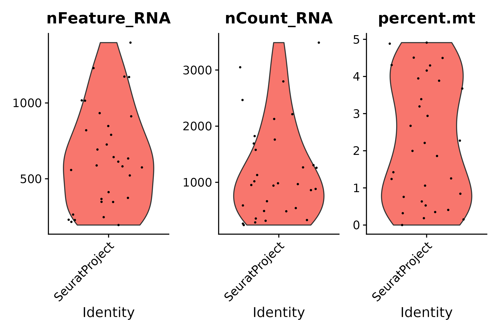

```{r setup, include=FALSE}
library(knitr)
setwd("/media/nguyen/Data1/github/bulahwoo/pc33/data/03_starsoloFiltered/")
```

### FastQC

Output can be found [here (read 1)](../shared/fastqc/pc33_read1/fastqc.md) and [here (read 2)](../shared/fastqc/pc33_read2/fastqc.md).

&nbsp;

### barcodeRanks()

This is a filtered matrix processed by `STARsolo` using `emptyDrops()`.

&nbsp;

### emptyDrops()

This is a filtered matrix processed by `STARsolo` using `emptyDrops()`.

&nbsp;

### vlnplot()

```{r, summary_stat1, echo=FALSE}
summary_stat <- read.table("./files/summary_stat.tsv", header = T, sep = "\t")
colnames(summary_stat) <- c("Gene", "Cell", "Mean UMI/Cell", "Median UMI/Cell", "Mean Gene/Cell", "Median Gene/Cell")
rownames(summary_stat) <- c("Raw", "emptyDrops", "Step1", "Step2", "Step3.1", "Step3.2", "Step3")
```

- The raw matrix: this is exactly the raw matrix shown in [pc33 analysis using STARsolo raw matrix](../02_starsoloRaw/02_starsoloRaw.md).
```{r vlnplot01, echo=FALSE, fig.cap="pre-emptydrops", out.width = '60%', fig.align = 'center'}

kable(summary_stat[1,])
```

&nbsp;

- After emptyDrops()
```{r vlnplot02, echo=FALSE, fig.cap="post-emptydrops", out.width = '60%', fig.align = 'center'}

kable(summary_stat[2,])
```

&nbsp;

- STEP 1: filter genes detected in < 3 cells
```{r vlnplot03, echo=FALSE, fig.cap="seurat filter step 1", out.width = '60%', fig.align = 'center'}

kable(summary_stat[3,])
```

&nbsp;

- STEP 2: filter cells that contain < 200 genes detected
```{r vlnplot04, echo=FALSE, fig.cap="seurat filter step 2", out.width = '60%', fig.align = 'center'}
knitr::include_graphics("./files/plt_vln_filter02.png")
kable(summary_stat[4,])
```

&nbsp;

- STEP 3.1: following STEP 2, filter cells that contain ≤ 200 genes or ≥ 2500 genes detected
```{r vlnplot05, echo=FALSE, fig.cap="seurat filter step 3.1", out.width = '60%', fig.align = 'center'}
knitr::include_graphics("./files/plt_vln_filter03.png")
kable(summary_stat[5,])
```

&nbsp;

- STEP 3.2: following STEP 2, filter cells that contain ≥ 5% mitochondrial counts
```{r vlnplot06, echo=FALSE, fig.cap="seurat filter step 3.2", out.width = '60%', fig.align = 'center'}

kable(summary_stat[6,])
```

&nbsp;

- STEP 3: following STEP 2, filter cells that contain ≤ 200 genes or ≥ 2500 genes detected, and filter cells that contain ≥ 5% mitochondrial counts
```{r vlnplot07, echo=FALSE, fig.cap="seurat filter step 3", out.width = '60%', fig.align = 'center'}
knitr::include_graphics("./files/plt_vln_filter.png")
kable(summary_stat[7,])
```

&nbsp;

- Summary
```{r, summary_stat2, echo=FALSE}
kable(summary_stat)
```

&nbsp;

- STARsolo summary

This summary is generated by `STARsolo`.

```{r, summary_star, echo=FALSE}
summary_star <- read.table("./files/summary_star.tsv", header = T, sep = "\t")
kable(summary_star)
```

&nbsp;

### UMAP
```{r umap, echo=FALSE, fig.cap="umap", out.width = '60%', fig.align = 'center'}
knitr::include_graphics("./files/umap.png")
```

&nbsp;
